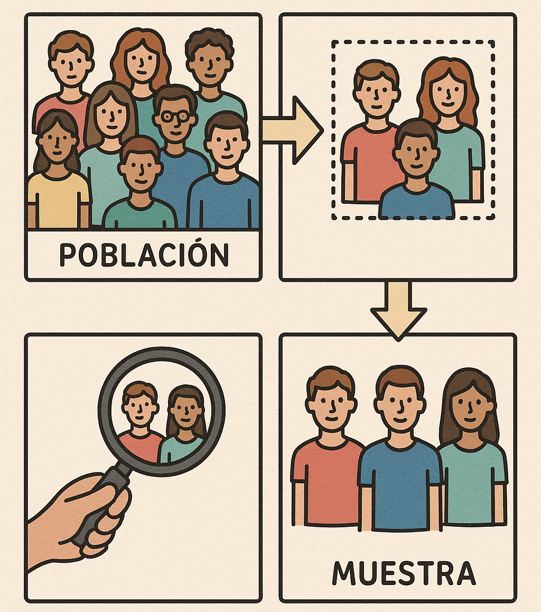
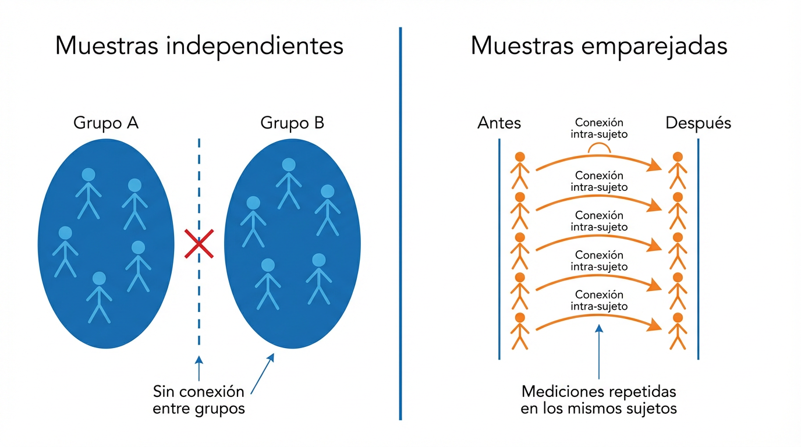

# Intervalos de Confianza y Pruebas de Hipótesis

Imagina que eres el gerente de un restaurante que acaba de lanzar un nuevo plato estrella y quieres saber si a tus clientes les gusta tanto como esperabas.

Después de varias semanas recogiste las opiniones de algunos clientes: les pediste que calificaran de 1 a 5 qué tan satisfechos quedaron.  

Ya sabes calcular promedios, medianas y varianzas (¡bien hecho hasta aquí 🎉!), pero surge una nueva pregunta:  

> ¿Podemos usar la muestra de clientes que respondieron para decir algo sobre **todos** los clientes del restaurante, incluso los que no alcanzamos a encuestar?

Aquí entran en juego dos herramientas de la estadística inferencial: **los intervalos de confianza** y **las pruebas de hipótesis**.  

---

## Intervalos de Confianza

Imagina que lanzaste un nuevo plato al menú y quieres saber si a los clientes realmente les gusta. No puedes preguntarle a cada comensal, pero sí ofreces muestras del plato a algunos clientes y recoges sus calificaciones. Esas degustaciones te dan una pista, no la verdad absoluta, sobre la opinión de toda la clientela. 

En la mayoría de estudios sucede esto: se toma una muestra y se infiere información sobre la población total. Esto es porque es muy difícil o costoso preguntar a todos los clientes.

<figure style="text-align: center;">
   
</figure>

Un intervalo de confianza funciona igual para un parámetro (por ejemplo, el promedio de satisfacción): parte de la estimación obtenida en la muestra (la "degustación") y le añade y quita un margen de error para formar un rango plausible. Dos puntos clave para entenderlo intuitivamente:

- Interpretación práctica: cuando hablamos de un "IC 95%" describimos el método: si repitieras el muestreo muchas veces y construyeras intervalos con el mismo procedimiento, alrededor del 95% de esos intervalos incluirían el valor verdadero desconocido. No quiere decir que exista un 95% de probabilidad de que este intervalo concreto lo contenga; el valor real es fijo y lo que cambia es el intervalo que construimos.

- *¿Qué influye en el ancho del intervalo?*

1. La dispersión de las calificaciones — más variabilidad → intervalos más anchos.
2. El tamaño de la muestra — más clientes encuestados → intervalos más estrechos.
3. El nivel de confianza elegido — mayor confianza → intervalos más amplios.

Visualiza esto como elegir el tamaño de la degustación y el margen de seguridad alrededor de tu estimación: si usas un margen muy amplio te aseguras de cubrir el valor verdadero pero pierdes precisión; si eliges un margen muy estrecho ganas precisión pero aumentas la probabilidad de equivocarte.

En resumen: un intervalo de confianza te ofrece un rango razonable para la media poblacional (por ejemplo, la satisfacción real de todos los clientes), acompañado de una medida explícita de cuánta confianza te da ese procedimiento si lo repitieras muchas veces.

<figure style="text-align: center;">
   
</figure>

La intuición es muy parecida a un pronóstico del clima: no te promete la cifra exacta, pero sí un rango razonable para tomar decisiones.

<figure style="text-align: center;">
   
</figure>

La intuición clave es simple: el dato más importante sigue siendo el promedio muestral, pero ahora lo acompañamos de una banda de incertidumbre.

### ¿Cómo se construye?

El intervalo de confianza toma el promedio de tu muestra y le agrega un “margen de error”.  

Ese margen depende de dos cosas:  
- Qué tan variable son las opiniones (la desviación estándar).  
- Cuántos clientes alcanzaste a encuestar (el tamaño de la muestra).  

::: callout-tip
## Fórmula del intervalo
$$
   ext{estimación} \pm \text{margen de error}
$$

- Más variabilidad: margen más grande.  
- Más observaciones: margen más pequeño.  
- Más confianza: intervalo más ancho.  
:::

### Ejemplo del restaurante

Encuestaste a **50 clientes**.  
El promedio de satisfacción fue **4.2** y la desviación estándar **0.8**.

Con esos datos, el intervalo de confianza al 95% es aproximadamente **de 4.0 a 4.4**.

Esto significa que, aunque no hablamos con todos los clientes, estimamos que la satisfacción promedio real de *todos* los comensales está en ese rango.

::: callout-tip
**En otras palabras un intervalo de confianza dice:**

**No estoy 100\% seguro de la cifra exacta, pero tengo un rango muy confiable donde debe estar el promedio verdadero si pudiéramos preguntar a todos los clientes.**

:::

---

## Pruebas de Hipótesis

Ahora imagina otra situación: tu socio del restaurante es un poco escéptico y te dice:  
> “*Yo creo que los clientes nos califican, en promedio, con 4. Nada más*.”  

Tú, viendo tus datos, sospechas que en realidad el promedio es **mayor** a 4.  

¿Cómo decidir quién tiene razón?

Aquí usamos una **prueba de hipótesis**. Es como un juicio estadístico:  

- Partimos de la **hipótesis nula (H₀)**: lo que asumimos de entrada.  
- Luego vemos si hay suficiente evidencia en la muestra para rechazarla y quedarnos con la **hipótesis alternativa (H₁)**.

### Pasos de la prueba

1. **Plantear hipótesis**  
   - H₀: el promedio es 4.  
   - H₁: el promedio es mayor que 4.  

2. **Elegir un nivel de significancia**  
   - Normalmente usamos 5% (α = 0.05).  
   - Esto quiere decir que toleramos un 5% de riesgo de equivocarnos al rechazar H₀.  

3.  **Calcular el p-valor y tomar la decisión**

- Usamos el software de preferencia para calcular la prueba t y obtener el p-valor.
- Si el p-valor es menor que 0.05, rechazamos H₀; si no, no la rechazamos.

::: callout-note
Nota práctica: no necesitas calcular el p-valor a mano

La mayoría de los paquetes estadísticos calculan y reportan el p-valor automáticamente:

- En R: `t.test(x, mu = 4)` devuelve la estadística, el p-valor y el intervalo de confianza.
- En Python (SciPy): `scipy.stats.ttest_1samp(x, 4)` devuelve la estadística t y el p-valor.
- En Excel: la herramienta de análisis de datos o la función T.TEST reportan p-valores.

Lo importante es entender qué mide el p-valor y cómo interpretarlo, no hacer el cálculo manual cada vez.

:::

---

### Ejemplo del restaurante

Con los datos de antes (promedio 4.2, variabilidad 0.8 y 50 clientes) podemos usar el concepto de *p-valor* para decidir si rechazar H₀.

El **p-valor** es la probabilidad de obtener un resultado igual o más extremo que el observado, *asumiendo que H₀ es verdadera*. En otras palabras: **¿qué tan raro sería ver este dato si en realidad no hay diferencia?**

- p-valor pequeño (p. ej. 0.03) → resultado muy inusual bajo H₀ → hay evidencia para rechazarla.
- p-valor grande (p. ej. 0.40) → resultado completamente compatible con H₀ → no hay evidencia suficiente para rechazarla.

<figure style="text-align: center;">
   
</figure>

La idea visual sigue siendo la misma: si el resultado observado cae en una zona muy rara bajo H₀, empezamos a dudar de esa hipótesis.

Aplicando esto a nuestros datos, el p-valor unilateral resultante es aproximadamente $p \approx 0.038$ (≈3.8\%). Es decir: si de verdad el promedio fuera 4, sólo en ~3.8\% de las muestras obtendríamos un resultado tan extremo por azar.

Regla de decisión: si $p < \alpha$ (por ejemplo $\alpha=0.05$), rechazamos H₀. Aquí $0.038 < 0.05$, por lo que la evidencia es lo suficientemente fuerte para rechazar H₀.

::: callout-tip
## Veredicto
Rechazamos H₀.  
Podemos afirmar que, en promedio, tus clientes están **más satisfechos** que el 4 que sospechaba tu socio.
:::

---

::: callout-note
Importante — "rechazar" vs "aceptar" H₀

En estadística decimos que *rechazamos* la hipótesis nula o *no la rechazamos*, pero no la *aceptamos* como verdadera. Intuitivamente es así porque la prueba está diseñada para buscar evidencia en contra de H₀: si la evidencia es fuerte, la descartamos; si no lo es, simplemente no tenemos base para descartarla.

Piensa en un juicio: la ausencia de pruebas suficientes para condenar no es una prueba de inocencia absoluta. Del mismo modo, que los datos no permitan rechazar H₀ puede deberse a que H₀ es plausible *o* a que la muestra es pequeña o el test no tiene poder suficiente para detectar la diferencia (error tipo II). Por eso los científicos hablan de "no rechazar" y complementan con tamaño del efecto y poder del estudio.

:::

::: callout-warning
## Errores frecuentes al interpretar pruebas
- **"Aceptamos H₀"** → lo correcto es "no rechazamos H₀": no encontramos evidencia en contra, pero eso no la prueba verdadera.
- **Elegir prueba unilateral después de ver los datos** para obtener un p-valor más pequeño distorsiona el análisis.
- **Confundir significancia estadística con importancia práctica**: con muestras muy grandes, diferencias minúsculas pueden resultar "significativas" aunque sean irrelevantes para el negocio.
:::

##  Comparando dos grupos: ¿de verdad son diferentes?

> **Idea clave:** tener dos medias con valores distintos **no** implica automáticamente que sean **estadísticamente diferentes**.  
> Una diferencia pequeña puede deberse al azar de a quiénes encuestamos, especialmente si las muestras son pequeñas o muy variables.

Imagina que tu restaurante tiene **dos sedes**:

- **Sede Norte**: acabas de implementar una capacitación en servicio.
- **Sede Sur**: aún no (sirve como comparación).

Encuestas la satisfacción (1 a 5) de clientes en ambas sedes y obtienes:

- **Norte:** promedio 4.3, variabilidad 0.7, 40 clientes  
- **Sur:** promedio 4.1, variabilidad 0.9, 45 clientes

A simple vista **4.3 vs 4.1** luce mejor en Norte, ¿pero alcanza para concluir que la capacitación **elevó** la satisfacción? Vamos paso a paso.

### Prueba de dos medias (grupos independientes)

Cuando las personas encuestadas en un grupo **no** son las mismas del otro grupo (clientes distintos en cada sede), usamos una prueba de dos muestras **independientes**. Por defecto, usa la versión **Welch** (no asume varianzas iguales).

**Hipótesis (bilateral):**

- H₀: no hay diferencia real entre las sedes.
- H₁: sí hay diferencia real entre las sedes.

Con un nivel de significancia de 5%,
el **p-valor** bilateral es aproximadamente **0.25**: no hay evidencia suficiente para afirmar que las medias difieren. **No rechazamos H₀.**  

Además, el intervalo de confianza para la diferencia va aproximadamente de **-0.15 a 0.55**. Como el **0** está dentro del intervalo, la diferencia podría ser nula.

::: callout-tip
## Lectura práctica
- Que la media de Norte sea 4.3 y la de Sur 4.1 **no basta** para declarar una mejora real.
- Con esta evidencia, **no podemos asegurar** que la capacitación subió la satisfacción; necesitamos más datos o un efecto más grande.
:::

#### Decidir unilateral vs bilateral
- **Bilateral ($\neq$)** cuando buscas *cualquier* diferencia.  
- **Unilateral (> o <)** solo si **antes de ver los datos** tienes una hipótesis direccional clara (p. ej., "la capacitación **aumenta** la satisfacción").  
 

### ¿Y si las muestras son las mismas personas? (Prueba pareada)

Otra historia típica del restaurante: encuestas a **los mismos clientes** **antes** y **después** de la capacitación en la **Sede Norte**.  

Aquí cada persona funciona como su **propio control** → usamos una prueba **pareada** (de medias de **diferencias**). Al comparar a cada cliente consigo mismo, eliminamos la variabilidad entre personas y el test se vuelve más sensible para detectar cambios reales.

- Hipótesis:
   - H₀: en promedio, no cambia.
   - H₁: en promedio, mejora.

**Ejemplo:** 30 clientes habituales,  
mejora promedio de **0.25 puntos**.  

Con una prueba unilateral al 5%, esto **sí** es significativo ($p \approx 0.01$).  

**Interpretación:** en la *misma* sede y *mismas* personas, la satisfacción **aumentó** tras la capacitación.

::: callout-important
## ¿Independientes o pareadas?
- **Independientes:** Norte vs Sur (clientes **distintos** en cada sede).  
- **Pareadas:** Antes vs Después en **la misma** sede y **mismas** personas.
:::

<figure style="text-align: center;">
   
</figure>

Esta comparación evita uno de los errores más comunes del capítulo: elegir la prueba por costumbre y no por la estructura real de los datos.

---

### Checklist rápido para comparar dos medias

1. **Escenario:**  
   - ¿Independientes (Norte vs Sur) o Pareadas (Antes vs Después)?
2. **Dirección de la hipótesis:**  
   - ¿Buscas *cualquier* diferencia (bilateral) o una mejora concreta (unilateral)?

::: callout-tip
## Estadísticamente vs. prácticamente significativo
Un resultado puede ser estadísticamente significativo pero **poco relevante** en la práctica (p. ej., mejora de 0.05 puntos en satisfacción con miles de encuestas).  
En decisiones de negocio, combina el resultado estadístico con el **impacto real**.
:::

### En resumen

| Situación | Herramienta | Pregunta que responde |
|-----------|-------------|----------------------|
| Estimar el verdadero promedio | Intervalo de confianza | ¿En qué rango está la satisfacción real de todos los clientes? |
| Evaluar una afirmación sobre una media | Prueba t (1 muestra) | ¿El promedio es distinto de X? |
| Comparar dos grupos distintos | Prueba t independiente | ¿Hay diferencia real entre Sede Norte y Sede Sur? |
| Comparar antes/después en las mismas personas | Prueba t pareada | ¿Hubo un cambio real en los mismos clientes? |

::: callout-tip
**Para llevar:**

- Los **intervalos de confianza** te dan un rango plausible para el verdadero promedio de toda la población.
- Las **pruebas de hipótesis** son como un juicio: partimos de H₀ y vemos si la evidencia la derrumba.
- Siempre combina el resultado estadístico con el **impacto práctico**: que algo sea significativo no significa que sea importante para el negocio.
:::