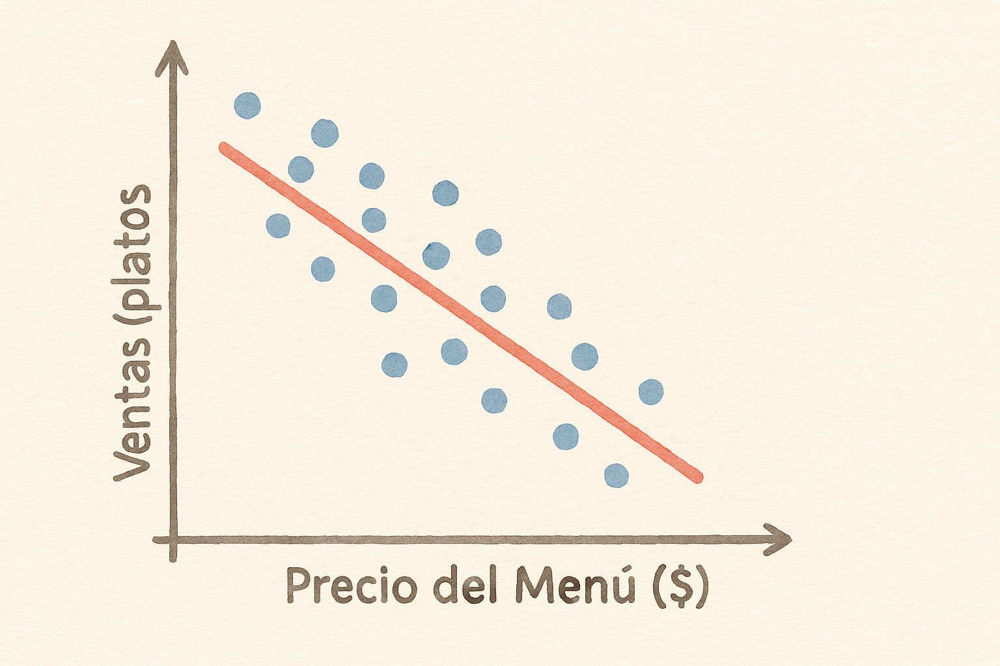

# Descubriendo Patrones con Regresión Lineal

```{r}
#| label: configuracion-graficos-capitulo6
#| include: false
if (.Platform$OS.type == "windows") Sys.setlocale("LC_CTYPE", ".UTF-8")
knitr::opts_chunk$set(dev="png", dev.args=list(type="cairo"))
```

{ width="60%" fig-align="center" }

Imagina que eres dueño de un restaurante 🍝.  
Cada día recibes clientes, vendes platos y al final de la semana te preguntas:

> **¿Qué hace que mis ventas suban o bajen?**  
> ¿Será el precio de los platos, la inversión en publicidad, o quizá los fines de semana festivos?

Aquí entra en acción la **regresión lineal**, una herramienta que nos ayuda a descubrir patrones escondidos en los datos.


## Una primera pista con la Regresión Simple

Empecemos simple: ¿qué pasa con tus ventas y el precio del menú?  

En estos ejemplos, **Ventas** es el número de platos vendidos por semana, no el dinero recaudado. Es la variable que queremos explicar o predecir ($Y$). **Precio** es el precio de un plato, medido en unidades monetarias, y es la variable que usamos como pista ($X$). Cada punto del gráfico representa una semana.

Si anotas tus datos semana a semana y los pones en un gráfico como el de abajo, notarás que cuando el precio sube, las ventas tienden a bajar. La regresión lineal traza la **mejor línea recta** que explica esa relación.

¿Por qué una línea si los puntos están dispersos? Porque buscamos resumir la **tendencia promedio**: dos semanas con el mismo precio pueden tener ventas distintas. La línea da una predicción para ese precio; no promete acertar exactamente cada semana.

{ width="60%" fig-align="center" }


El modelo distingue la parte que representa la línea y lo que queda fuera de ella:

$$
Ventas = b_0 + b_1 \times Precio + \varepsilon
$$

- **$b_0$**: el intercepto; ubica la altura de la recta. Corresponde a las ventas promedio cuando el precio es cero, aunque vender gratis esté fuera de los datos y esa interpretación no sea útil 🍕.  
- **$b_1$**: la *pendiente*; cuánto cambian las ventas promedio según el modelo por cada unidad adicional de precio.  
- **$\varepsilon$**: el ruido que la línea no puede explicar (clima, humor del chef, partidos de fútbol, etc.).  

👉 Si el modelo encuentra que:

$$
\hat{Ventas} = 500 - 25 \times Precio
$$

El sombrero en $\hat{Ventas}$ significa **ventas predichas**. Para usar la ecuación, reemplazamos el precio y hacemos la cuenta:

::: {.table-responsive}
| Precio | Cálculo | Platos predichos por semana |
|---|---|---|
| 10 | $500 - 25\times 10$ | 250 |
| 11 | $500 - 25\times 11$ | 225 |
| 12 | $500 - 25\times 12$ | 200 |
:::

Al pasar de 10 a 11, la predicción baja de 250 a 225: **25 platos menos**. Si el precio aumenta dos unidades, baja $25\times 2=50$ platos. Esa variación constante es la intuición de la pendiente de una recta.

::: callout-note
## De la predicción al error
Si con un precio de 10 se vendieron realmente 270 platos, el **residuo** es $270-250=20$: el punto queda 20 platos por encima de la recta. Si se vendieron 230, el residuo es $230-250=-20$ y el punto queda por debajo. El residuo es la diferencia observable entre el dato y la predicción; $\varepsilon$ representa el error del modelo en la población.

La «mejor» recta por **mínimos cuadrados** es la que hace más pequeña la suma de los residuos al cuadrado. Los elevamos al cuadrado para que errores positivos y negativos no se cancelen y para penalizar más los errores grandes. Así elegimos una línea que se acerque al conjunto de puntos.
:::

Esta relación describe los datos, pero por sí sola no demuestra que cambiar el precio cause esa caída: quizá las semanas con precios altos también tuvieron menos publicidad. Además, conviene predecir dentro del rango de precios observado; prolongar la recta demasiado puede producir resultados absurdos, como ventas negativas.

```{r}
#| label: fig-pendiente-residuo
#| echo: false
#| fig-width: 7
#| fig-height: 4.8
#| out-width: "100%"
#| fig-cap: "La pendiente compara dos predicciones; el residuo compara una observación con su predicción."
#| fig-alt: "Recta de ventas igual a 500 menos 25 por precio. De precio 10 a 11 la predicción baja de 250 a 225. A precio 10, una observación de 270 está 20 platos por encima de la predicción."

par(mar=c(4.5, 4.5, 2, 1), cex=1.1, las=1)
plot(c(9, 12), c(180, 305), type="n", bty="l",
     xlab="Precio (unidades monetarias)", ylab="Platos por semana")
abline(a=500, b=-25, col="#2463A0", lwd=3)
segments(10, 250, 11, 250, col="#596579", lty=2, lwd=2)
arrows(11, 250, 11, 225, length=0.1, col="#2463A0", lwd=2)
points(c(10, 11), c(250, 225), pch=21, bg="white", col="#2463A0", cex=1.4, lwd=2)
text(10.5, 258, "+1 de precio", cex=0.95)
text(11.08, 241, "-25 platos", adj=0, col="#2463A0", cex=0.95)
arrows(10, 250, 10, 270, length=0.08, code=3, col="#B64D18", lwd=2)
points(10, 270, pch=19, col="#B64D18", cex=1.4)
text(9.93, 292, "270 observados", adj=1, col="#B64D18", cex=0.95)
text(10.08, 277, "+20 de residuo", adj=0, col="#B64D18", cex=0.9)
text(10, 239, "250", adj=1, col="#2463A0")
text(11, 215, "225", col="#2463A0")
```

Lee el gráfico en dos direcciones: **hacia la derecha**, la pendiente indica cómo cambia la predicción al cambiar el precio; **hacia arriba o abajo**, el residuo indica cuánto se alejó una semana de lo predicho.

## ¿Es realmente importante mi coeficiente? (significancia estadística)

Hasta ahora vimos que un coeficiente $b_1$ nos dice cómo cambia $Y$ cuando $X$ sube una unidad.  

Pero la gran pregunta es: **¿la pendiente observada es suficientemente clara para distinguirla de las fluctuaciones de una muestra?**

Aquí entran las **pruebas de hipótesis** que estudiamos en el capítulo anterior. Con otras semanas obtendríamos una pendiente algo distinta; la prueba tiene en cuenta esa incertidumbre.  

### El planteamiento

- **Hipótesis nula ($H_0$)**: el coeficiente en la población es igual a 0. En el modelo simple, la recta de ventas promedio sería horizontal: conocer el precio no cambiaría la predicción.
- **Hipótesis alternativa ($H_1$)**: el coeficiente en la población es diferente de 0. La recta de ventas promedio tendría una pendiente positiva o negativa.

Para evaluar la evidencia, puedes usar el **valor p (p-value)**. Imagina que la pendiente poblacional fuera cero y recogiéramos muchas muestras similares: aun así, algunas mostrarían pendientes distintas de cero por azar. El valor p indica qué tan probable sería obtener un estadístico de prueba tan extremo como el observado, o más, **si la hipótesis nula y los supuestos de la prueba fueran ciertos**. No es la probabilidad de que el coeficiente sea cero.

::: callout-note
## Prueba de significancia estadística
- Si el valor p es menor que 0.05, el coeficiente es **significativo al nivel del 5%**: rechazamos $H_0$ y encontramos evidencia de una asociación lineal entre precio y ventas.
- Si el valor p es mayor o igual que 0.05, no rechazamos $H_0$: los datos no ofrecen suficiente evidencia para distinguir el coeficiente de cero. Esto no demuestra que sea cero.
:::


### Ejemplo de restaurante 🍝  
Supongamos que obtienes un nuevo modelo al recoger más datos e incluir publicidad (más adelante veremos cómo interpretar varias variables juntas). Aquí **Publicidad** se mide en centenas de unidades monetarias: gastar 200 se registra como $Publicidad=2$.

$$
\hat{Ventas} = 400 - 20 \times Precio + 60 \times Publicidad
$$

- El coeficiente de **Precio = -20** indica una predicción de 20 platos menos por cada unidad adicional de precio, manteniendo fija la publicidad.  
- Pero, ¿y si esa relación negativa se debe solo a la casualidad en tus datos?  

### La prueba
El software (R, Excel, Stata, etc.) hace un **test t** que compara el coeficiente con su **error estándar**, una medida de la incertidumbre con que lo estimamos. Para probar un coeficiente igual a cero, calcula $t=\text{coeficiente estimado}/\text{error estándar}$.

Por ejemplo, una pendiente de $-20$ con error estándar de 5 está a cuatro errores estándar de cero ($t=-4$); con error estándar de 25 está a menos de uno ($t=-0.8$). Aunque la pendiente es la misma, el primer caso ofrece evidencia más clara de una asociación. El p-valor se obtiene a partir de ese estadístico y de los grados de libertad del modelo.

- Si el **p-valor < 0.05**, rechazamos la hipótesis nula. Encontramos evidencia de una asociación entre precio y ventas, controlando por publicidad.
- Si el **p-valor ≥ 0.05**, no tenemos suficiente evidencia. La estimación es compatible con un coeficiente poblacional de cero; también puede haber una relación que estos datos no permitan detectar con claridad.

### La moraleja
Conviene separar dos preguntas: **¿de qué tamaño es la asociación estimada?** (el coeficiente) y **¿qué evidencia tenemos de que difiere de cero?** (la prueba). Una asociación pequeña puede ser significativa con muchos datos, y una grande puede estimarse con mucha incertidumbre. La significancia estadística no garantiza importancia para el negocio ni demuestra causalidad.  

👉 En negocios, antes de tomar decisiones (subir precios, invertir en publicidad, lanzar una promo), debemos considerar el tamaño de la asociación, su incertidumbre y si la comparación permite atribuir los cambios a esa decisión.


## Midiendo qué tan bien funciona mi regresión

No basta con tener la línea (regresión), también queremos saber **qué tan buena es**.  

Para eso usamos el famoso **$R^2$**, también llamado coeficiente de determinación. La idea es comparar dos maneras de predecir las semanas que usamos para ajustar el modelo:

1. **Sin usar el precio:** predecir siempre el promedio de ventas, como una línea horizontal.
2. **Usando el precio:** predecir con la recta de regresión.

En una regresión por mínimos cuadrados con intercepto, $R^2$ mide cuánto se reduce la suma de errores al cuadrado al pasar de la primera opción a la segunda. Si era 10 000 al usar el promedio y queda en 2 000 al usar la recta:

$$
R^2=1-\frac{2\,000}{10\,000}=0.8
$$

```{r}
#| label: fig-r2-promedio
#| echo: false
#| fig-width: 7
#| fig-height: 7
#| out-width: "100%"
#| fig-cap: "Los mismos datos, dos formas de predecir. Los segmentos verticales muestran los errores que elevamos al cuadrado y sumamos."
#| fig-alt: "Dos gráficos con las mismas cinco semanas. Arriba, una línea horizontal en 250 platos produce errores cuadrados que suman 10000. Abajo, una recta descendente reduce la suma a 2000: R cuadrado es 0.8."

# Estos cinco datos dan exactamente las sumas del ejemplo.
precio_r2 <- 8:12
residuo_r2 <- c(1, -2, 2, -2, 1) * sqrt(2000/14)
ventas_r2 <- 250 - sqrt(800)* (precio_r2-10) + residuo_r2
ajuste_r2 <- lm(ventas_r2 ~ precio_r2)
stopifnot(abs(sum((ventas_r2-mean(ventas_r2))^2)-10000) < 1e-7,
          abs(sum(residuals(ajuste_r2)^2)-2000) < 1e-7)
par(mfrow=c(2,1), mar=c(4.5,4.5,3,1), cex=1.1, las=1)
for (usar_precio in c(FALSE, TRUE)) {
  pred <- if (usar_precio) fitted(ajuste_r2) else rep(mean(ventas_r2), 5)
  color <- if (usar_precio) "#2463A0" else "#596579"
  plot(precio_r2, ventas_r2, type="n", ylim=c(175,335), bty="l",
       xlab="Precio", ylab="Platos por semana",
       main=if (usar_precio) "2. Con precio: suma = 2 000" else "1. Solo el promedio: suma = 10 000")
  segments(precio_r2, pred, precio_r2, ventas_r2, col="#B64D18", lwd=2, lty=2)
  lines(precio_r2, pred, col=color, lwd=3)
  points(precio_r2, ventas_r2, pch=19, cex=1.1, col="#24364B")
}
```

Los puntos no cambian entre los dos paneles: cambia la regla de predicción. Al usar el precio, la suma de errores al cuadrado baja de 10 000 a 2 000, una reducción del 80%.

- Si $R^2 = 0.8$ en el modelo simple, la recta con precio recoge el 80% de la variación de las ventas alrededor de su promedio **en la muestra utilizada**. En el modelo múltiple, ese porcentaje corresponde al conjunto de variables.  
- El 20% restante queda en los residuos: puede incluir clima, competencia, azar u otros patrones que el modelo no recoge. El $R^2$ no identifica cuál de estas razones lo explica.  

Si $R^2 = 0$, la recta no mejora la predicción frente al promedio en esa muestra. Aun así, podría existir un patrón curvo que una recta no capture.

Si $R^2 = 1$, todas las observaciones de la muestra quedan sobre la línea: los residuos son cero. Eso no garantiza acertar en semanas futuras.

::: callout-tip
Piensa en $R^2$ como una medida de cuánto mejora el ajuste frente a usar solo el promedio. Un $R^2=0.8$ **no significa acertar el 80% de las semanas**, ni que el precio cause el 80% de las ventas. Para evaluar predicciones futuras necesitamos comprobar los errores en datos que no se usaron para ajustar el modelo.
:::

## Sumando más ingredientes: la Regresión Múltiple

En la vida real, tus ventas no dependen solo del precio.  
En tu restaurante también influyen otros “ingredientes” del negocio:  

- el **precio** del menú,  
- el **dinero invertido en publicidad**,  
- y si fue o no una **semana festiva**.  

La regresión múltiple nos permite poner todos esos factores en la misma receta estadística. Conservamos la publicidad en centenas de unidades monetarias y definimos **Festivo = 1** para una semana festiva y **Festivo = 0** para una que no lo es. Supongamos que tus datos arrojan:

$$
\begin{aligned}
\hat{Ventas} ={}& 400 - 20 \times Precio \\
&+ 60 \times Publicidad + 15 \times Festivo
\end{aligned}
$$


Interpretación, manteniendo constantes las demás variables del modelo:  

- Cada unidad adicional de precio se asocia con 20 platos menos por semana.  
- Cada 100 unidades monetarias adicionales en publicidad se asocian con 60 platos más.  
- Una semana festiva tiene una predicción de 15 platos más que una no festiva.  

Para verlo, partamos de una semana con precio de 10, publicidad de 200 y sin festivo:

$$
\hat{Ventas}=400-20\times10+60\times2+15\times0=320
$$

Ahora cambiamos **una sola característica cada vez** respecto de esa semana:

::: {.table-responsive}
| Escenario | Precio | Publicidad (centenas) | Festivo | Platos predichos |
|---|---|---|---|---|
| Semana de partida | 10 | 2 | 0 | 320 |
| Solo cambia el precio | 11 | 2 | 0 | 300 |
| Solo cambia la publicidad | 10 | 3 | 0 | 380 |
| Solo cambia el festivo | 10 | 2 | 1 | 335 |
:::

Las diferencias frente a 320 son precisamente $-20$, $+60$ y $+15$. Esto es lo que significa **mantener lo demás constante**: comparar las predicciones de dos semanas iguales en las otras variables del modelo.


::: callout-tip
Plantilla de interpretación (ceteris paribus): significa que por cada unidad que aumente **variable**, la **variable dependiente** cambia en promedio **coeficiente** unidades, manteniendo constantes las demás variables. 

Ejemplo: por cada unidad que aumenta el precio, las ventas semanales predichas disminuyen en promedio 20 platos, manteniendo la publicidad y la condición de semana festiva constantes.
:::

En otras palabras, la regresión múltiple permite **comparar teniendo en cuenta varias características a la vez**. Si las semanas de precios bajos también tuvieron más publicidad, el modelo simple puede mezclar ambas asociaciones. Incluir publicidad ayuda a distinguirlas, pero no controla automáticamente factores que no medimos ni convierte la comparación en un experimento.  


### Significancia en la regresión múltiple

En regresión múltiple evaluamos la significancia de cada coeficiente de la misma manera que en la regresión simple: mediante un estadístico t y su p-valor. Cada coeficiente se interpreta **ceteris paribus** (manteniendo las demás variables constantes), por eso es importante no mezclar la interpretación de los efectos.

Ejemplo (resumen):

- Usamos el mismo modelo de precio, publicidad y festivo de la ecuación anterior.
- p-valores (ej.): Precio $p<0.01$ (significativo), Publicidad $p=0.18$ (no significativo), Festivo $p=0.03$ (significativo)

Aunque el coeficiente de publicidad sea 60, su p-valor ($p=0.18$) indica que, al nivel del 5%, no hay suficiente evidencia para distinguir su coeficiente poblacional de cero una vez controlamos por precio y festivo. **La estimación sigue siendo 60, no se convierte en 0**, y sigue entrando en las predicciones del modelo ajustado. Podríamos necesitar más datos o mayor variación en publicidad para estimarla con precisión; no podemos concluir que la publicidad sea inútil.

## Conclusión

La regresión lineal, ya sea simple o múltiple, funciona como una lupa 🔍:  
te ayuda a **resumir cómo se relacionan las variables con tus resultados**, hacer predicciones y evaluar la incertidumbre de esas relaciones.  

En el restaurante esto significa tomar decisiones con más confianza:  
¿bajo precios?, ¿aumento el presupuesto en publicidad?, ¿aprovecho mejor los festivos?  

👉 La magia está en que no tienes que adivinar. Los datos te cuentan la historia, y la regresión es el traductor.


## Extensiones del modelo de regresión lineal

Hasta ahora, hemos usado modelos de regresión lineal “simples” para predecir ventas en tu restaurante según precio, publicidad o si era semana festiva. Pero el mundo real es más complejo: las variables **pueden interactuar** entre sí y la relación con las ventas **no siempre es lineal**.  

Veamos cómo ampliar la receta de la regresión lineal para capturar estos matices.  

---

### Cuando los ingredientes se combinan: Interacciones

Imagina que lanzas un nuevo plato y quieres saber cómo influye el **precio** en las ventas. Pero tal vez el impacto del precio depende de otra variable, por ejemplo, si hiciste o no **publicidad**.  

- Si no hay publicidad, un descuento en el precio podría no atraer a muchos clientes.  
- Si sí hay publicidad, ese mismo descuento puede disparar las ventas.  

Esto se llama **interacción**: el efecto de una variable depende del valor de otra.  

Para este ejemplo, cambiamos la forma de registrar **Publicidad**: ahora vale **1 si hubo campaña y 0 si no la hubo**, en lugar de medir el gasto en centenas. Así podemos comparar dos rectas, una para cada situación.

$$
\begin{aligned}
Ventas ={}& b_0 + b_1 \times Precio + b_2 \times Publicidad \\
&+ b_3 \times (Precio \times Publicidad) + \varepsilon
\end{aligned}
$$

El término $b_3$ mide cuánto cambia el efecto del precio cuando hay publicidad.  

Supongamos que la ecuación estimada es:

$$
\begin{aligned}
\hat{Ventas} ={}& 400-10\times Precio+100\times Publicidad \\
&-10\times(Precio\times Publicidad)
\end{aligned}
$$

Sustituimos el indicador:

- **Sin campaña ($Publicidad=0$):** los términos con publicidad desaparecen y queda $\hat{Ventas}=400-10\times Precio$.
- **Con campaña ($Publicidad=1$):** queda $\hat{Ventas}=500-20\times Precio$.

Al bajar el precio de 10 a 9, la primera recta pasa de 300 a 310 platos y la segunda de 300 a 320. El mismo descuento se asocia con **10 platos adicionales sin campaña y 20 con campaña**. El coeficiente de interacción, $-10$, es la diferencia entre las pendientes: $-20-(-10)=-10$. Sin interacción, las dos rectas tendrían la misma pendiente.

```{r}
#| label: fig-interaccion-publicidad
#| echo: false
#| fig-width: 7
#| fig-height: 4.8
#| out-width: "100%"
#| fig-cap: "Con interacción, las rectas tienen pendientes distintas: el mismo descuento cambia la predicción en cantidades diferentes."
#| fig-alt: "A precio 10, ambas rectas predicen 300 platos. Al bajar a 9, la recta sin campaña predice 310 y la recta con campaña predice 320."

par(mar=c(4.5,4.5,2,1), cex=1.1, las=1)
plot(c(8.5,10.5), c(285,345), type="n", bty="l",
     xlab="Precio (unidades monetarias)", ylab="Platos predichos por semana")
abline(a=400, b=-10, col="#2463A0", lwd=3, lty=2)
abline(a=500, b=-20, col="#B64D18", lwd=3)
segments(9, 285, 9, 320, lty=3, col="#8591A1")
points(c(9,9,10), c(310,320,300), pch=c(17,19,19),
       col=c("#2463A0","#B64D18","#24364B"), cex=1.3)
text(9.05, 325, "320: +20 con campaña", adj=0, col="#B64D18", cex=0.95)
text(8.95, 304, "310: +10\nsin campaña", adj=1, col="#2463A0", cex=0.95)
text(10.07, 303, "300", adj=0, col="#24364B")
legend("topright", legend=c("Con campaña", "Sin campaña"),
       col=c("#B64D18", "#2463A0"), lty=c(1,2), lwd=3, bty="n", cex=0.9)
```

::: callout-tip
**Intuición:** no todos los ingredientes de tu receta funcionan igual por separado. A veces lo que importa es la mezcla.  
:::

---

### Relaciones no siempre lineales

Una recta supone que cada unidad adicional de precio cambia la predicción en la misma cantidad. Pero esa variación podría ser diferente según el precio de partida. Por ejemplo:  

- Pasar de un precio de 5 a 6 podría reducir la predicción en unos 19 platos.  
- Pasar de 10 a 11 podría reducirla en unos 29 platos.  

En ambos casos el precio sube una unidad, pero la caída es distinta. Eso dibuja una **curva** en vez de una recta.  

Para capturar ese patrón podemos agregar un **término cuadrático** al modelo:  

$$
Ventas = b_0 + b_1 \times Precio + b_2 \times Precio^2 + \varepsilon
$$

- $b_1$ acompaña al precio, pero ya no se interpreta por sí solo como el cambio por una unidad: al cambiar el precio también cambia su cuadrado.  
- $b_2$ permite que la curva se doble hacia arriba o hacia abajo.  

Por ejemplo, con $\hat{Ventas}=500-8\times Precio-Precio^2$, un precio de 5 da $500-40-25=435$ platos y uno de 6 da $500-48-36=416$: una caída de 19. De 10 a 11, las predicciones pasan de 320 a 291: una caída de 29. **Para interpretar el cambio, evaluamos la ecuación completa en ambos precios y restamos.**

Aunque la gráfica sea curva, seguimos hablando de regresión lineal porque los coeficientes $b_0$, $b_1$ y $b_2$ entran sumando, cada uno multiplicado por una variable conocida ($Precio$ o $Precio^2$).

::: callout-tip
**Intuición:** en una recta, cada paso a la derecha implica el mismo cambio vertical. En una curva, ese cambio depende de dónde empezamos. Agregar $Precio^2$ permite representar esa diferencia; no garantiza que exista un precio óptimo dentro del rango observado.  
:::

```{r}
#| label: fig-grafico-cuadratico
#| fig-cap: "Relación cuadrática entre precio y ventas (ejemplo simulado)"
#| fig-alt: "Semanas simuladas alrededor de una curva descendente. La curva es más inclinada a precios altos: de 5 a 6 se pierden 19 platos predichos y de 10 a 11 se pierden 29."
#| echo: false
#| fig-width: 7
#| fig-height: 4.8
#| out-width: "100%"

set.seed(123)
par(mar=c(4.5,4.5,2,1), cex=1.1, las=1)
precio <- seq(5, 15, 0.5)
ventas_promedio <- 500 - 8*precio - precio^2
ventas <- ventas_promedio + rnorm(length(precio), 0, 15)
plot(precio, ventas, pch=19, col="#B64D18", bty="l",
     xlab="Precio (unidades monetarias)", ylab="Platos vendidos por semana")
lines(precio, ventas_promedio, col="#2463A0", lwd=3)
legend("topright", legend=c("Semanas simuladas", "Promedio del modelo"),
       col=c("#B64D18", "#2463A0"), pch=c(19, NA),
       lty=c(NA, 1), lwd=c(NA, 2), bty="n")
```

Los puntos representan semanas con variación alrededor del promedio y la curva azul muestra la relación usada para simularlos. La curva se hace más inclinada hacia abajo conforme aumenta el precio: cada unidad adicional se asocia con una caída mayor en las ventas promedio, dentro del rango mostrado.
